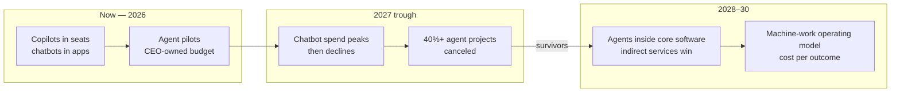
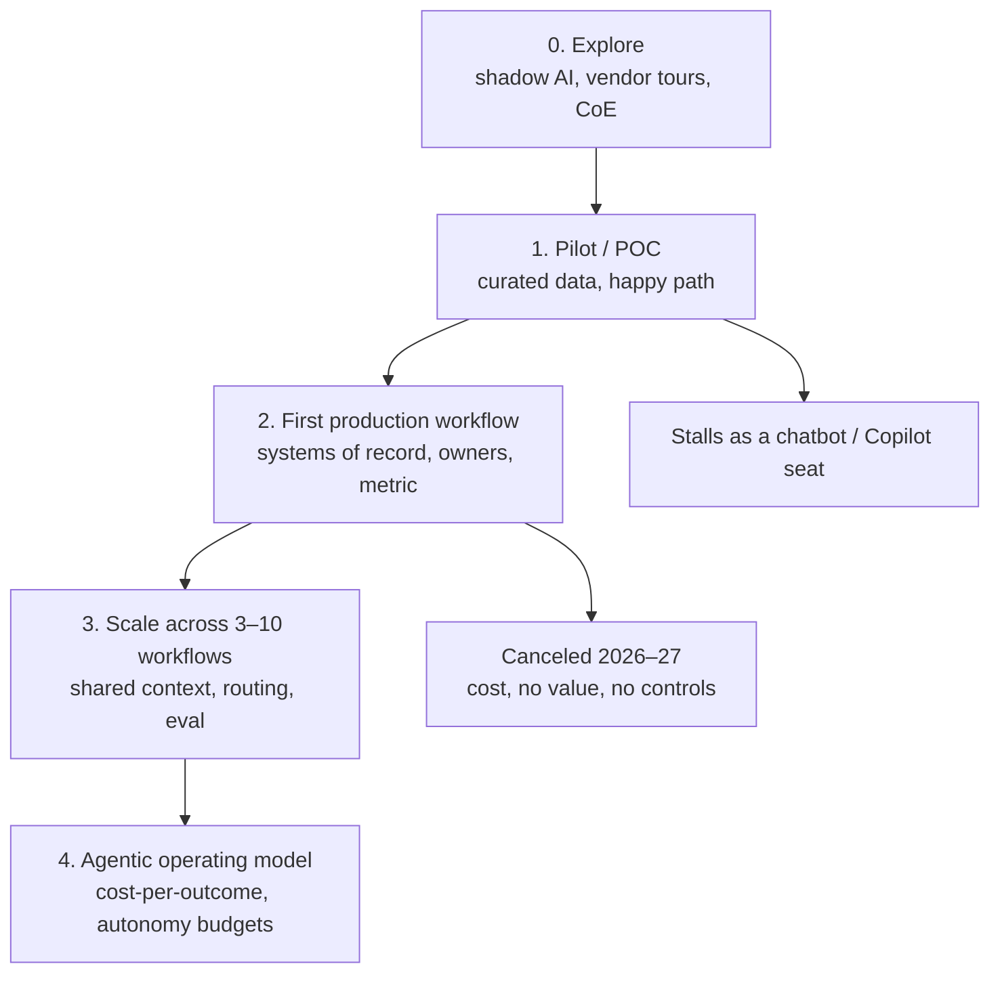
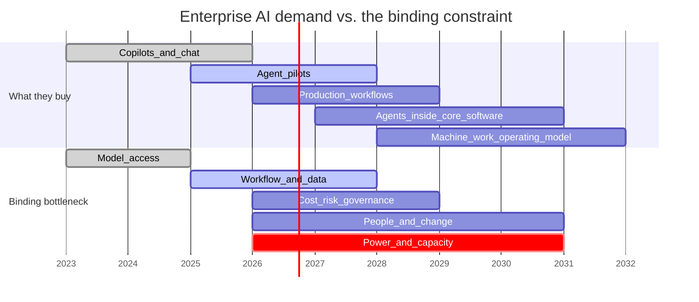
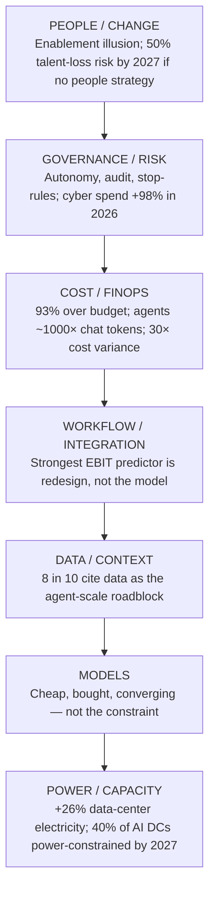
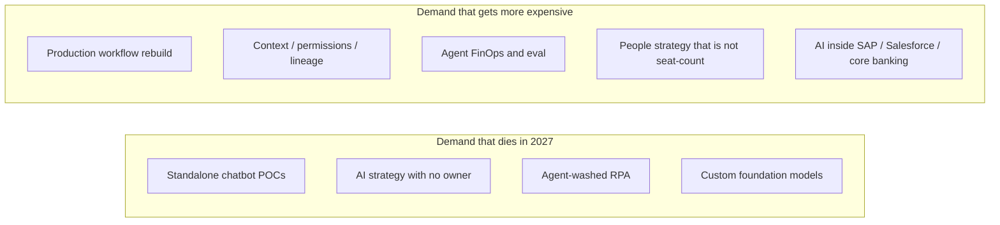

# Roadmap: how enterprise AI projects evolve — and where demand (and bottlenecks) go next

**Companion to** [corporate-ai-spend-opportunity.md](corporate-ai-spend-opportunity.md)  
**As of:** August 2026

Two pictures matter. The first is how a **single client project** dies or compounds. The second is how the **market** moves from copilots (2023–25) through agents (2026–27) into an operating-model problem (2028–30). Demand follows the surviving projects. Bottlenecks shift at each gate.

---

## The one-page answer

| Horizon | What buyers demand | What actually bottlenecks | What a transformation consultant sells |
| --- | --- | --- | --- |
| **2023–25** (mostly done) | Strategy, Copilot, POCs | Model access, talent to “do AI” | Roadmaps, CoEs, demos |
| **2026 (now)** | Agents that hit a KPI; prove ROI | **Workflow fit + data/context + integration** | One production process, not 40 use cases |
| **2027** | Kill or scale; cost control; risk | **Unclear value, runaway token bills, weak controls** (Gartner cancellation trio) | FinOps, stop-rules, agent governance |
| **2028** | AI inside ERP/CX/core systems, not a separate “AI program” | **Indirect delivery + change**; consulting hours lose share to software | Embed in the transformation already budgeted |
| **2029–30** | Autonomous workflows as the operating system | **Context moat, people, power (physical)** | Operating model for machine work; capability transfer |

The constraint is no longer “can we get a model.” It is **can this agent act on governed data, inside a redesigned process, at a cost the CFO will defend.**

---

## 1. How a project evolves inside the company

Every serious engagement follows the same funnel. Most of the market is stuck between step 2 and step 3.

### Drop-off at each gate (what the data actually says)

| Gate | What “success” looks like | How many make it | Typical failure mode |
| --- | --- | --- | --- |
| Explore → Pilot | Budget, a use-case list, a vendor | High. ~88% of orgs use AI in at least one function ([McKinsey State of AI, Nov 2025](https://www.mckinsey.com/capabilities/quantumblack/our-insights/the-state-of-ai)). ~90% have seriously explored buying ([MIT NANDA](https://mlq.ai/media/quarterly_decks/v0.1_State_of_AI_in_Business_2025_Report.pdf)). | This gate is no longer the market. |
| Pilot → **P&L / production** | Tool used in the live process; a sustained productivity or P&L effect | **Low.** MIT: only ~5% of *task-specific* GenAI tools reach this bar; generic ChatGPT/Copilot look successful (~83% “implemented”) but do not move EBIT. McKinsey: 39% report *any* EBIT; ~6% are high performers. | Brittle workflow, no memory/learning, misaligned with day-to-day work. Enterprises take **~9 months**; mid-market top performers **~90 days**. |
| Agent experiment → scaled agent | Agent runs a workstream end-to-end with value | McKinsey: ~two-thirds have *tried* agents; **fewer than 10%** have scaled them to tangible value. **8 in 10** cite **data limitations** as the roadblock. ([McKinsey, foundations for agentic AI](https://www.mckinsey.com/capabilities/mckinsey-technology/our-insights/building-the-foundations-for-agentic-ai-at-scale)) | Demo on a clean dataset; production estate is siloed, ungoverned, un-permissioned. |
| First production → fleet | Shared context layer, model routing, eval, FinOps | Rare. McKinsey State of AI: only about **one-third** have begun scaling AI at all; fully scaled is ~7%. | Each team rebuilds retrieval and prompts; costs explode (93% over AI budget, McKinsey FinOps May 2026). |
| Fleet → operating model | Intelligence allocated like capital; cost per completed outcome | The 2028–30 problem. Almost nobody is here yet. | Token price obsession; no owner of machine work; no stop rules. |

**Read the funnel as a sales map.** Money still exists at Explore (declining, commoditized). The paid, scarce work is **forcing Pilot → Production**, then **installing the platform that makes the second workflow cheap**.

### What the client pays at each stage

| Stage | Buyer | Check size (directional) | Duration |
| --- | --- | --- | --- |
| Explore / diagnostic | CIO or Head of AI | $15k–$75k | 2–4 weeks |
| Pilot (do not linger) | Function VP | $50k–$150k | 4–8 weeks — only if it has a production date |
| First production workflow | COO / CFO / P&L owner | $100k–$500k boutique; $500k–$2M SI | 10–16 weeks mid-market; 6–12 months enterprise |
| Scale + context + FinOps | CEO + CFO | Retainer or $500k–$5M program | 6–18 months |
| Operating model / managed AI ops | CEO | $5k–$25k+/month boutique; much more at SI | Ongoing |

If a project is still in “pilot” after two quarters in 2026, treat it as already on the 2027 cancellation list.

---

## 2. Market roadmap: 2023 → 2030

### Year by year

**2023–2024 — Innovation trigger.** ChatGPT, Copilot, strategy decks. Demand = “we need an AI story.” Bottleneck = model access and a team that could prompt. **This wave is over.** 76% of enterprise genAI use cases are now *purchased*, not built ([Menlo, Dec 2025](https://menlovc.com/perspective/2025-the-state-of-generative-ai-in-the-enterprise/)).

**2025 — Adoption without impact.** 88% using AI; ~6% capturing real EBIT. GenAI software spend hits **$37B** (3.2× in a year). Coding becomes the first killer app ($4B). Shadow AI: workers at 90% of firms use personal tools while official programs stall (MIT).

**2026 — Inflection, and the peak of agent hype.**  
Demand: CEOs own AI (72%), budgets **double to ~1.7% of revenue**, **>30% of that budget is already earmarked for agents** ([BCG AI Radar](https://www.bcg.com/publications/2026/as-ai-investments-surge-ceos-take-the-lead)). Gartner: **$2.59T** global AI spend; services **$586B**; software **$453B**. Gartner’s Hype Cycle still parks **agentic AI at the Peak of Inflated Expectations** (Hype Cycle for Agentic AI, Apr 2026); only ~17% of orgs have deployed agents, while >60% plan to within two years.  
Bottleneck **inside the enterprise:** workflow redesign, data/context, integration — not the model.  
Bottleneck **in the physical stack:** power. Data-center electricity **+26% to 565 TWh**; AI-optimized servers ~31% of that draw ([Gartner, Jun 2026](https://www.gartner.com/en/newsroom/press-releases/2026-06-10-gartner-says-data-center-electricity-demand-to-grow-26-percent-in-2026)). That is a hyperscaler/utility problem. It shows up for your client as **higher inference prices and capacity caps**, which is why FinOps becomes a consulting product.

**2027 — Trough. This is the hinge year.** Three things happen at once:

1. **Chatbot/assistant spend inside enterprise software peaks, then declines.** Agentic spend overtakes it. (Gartner AI spending forecast, 4Q25 / 2Q26 vintages; later vintage puts embedded chatbot peak near **$273B in 2027**, then down toward ~$206B by 2030, with embedded agentic AI heading toward **~$1T by 2030**.)
2. **>40% of agentic AI projects canceled** by end-2027 — escalating cost, unclear value, inadequate risk controls — plus “agent washing” (thousands of vendors; ~130 real). ([Gartner, Jun 2025](https://www.gartner.com/en/newsroom/press-releases/2025-06-25-gartner-predicts-over-40-percent-of-agentic-ai-projects-will-be-canceled-by-end-of-2027))
3. **People become a hard constraint.** Gartner: by 2027, **50% of enterprises without a people-centric AI strategy lose top AI talent**; only 27% of execs have a comprehensive AI strategy and 20% believe the workforce is AI-ready. Leaders confuse seat adoption with transformation (“enablement illusion”). ([Gartner, May 2026](https://www.gartner.com/en/newsroom/press-releases/2026-05-13-gartner-predicts-by-2027-50-percent-of-enterprises-without-a-people-centric-ai-strategy-will-lose-their-top-ai-talent))

Demand in 2027 therefore **splits**: survivors pay to industrialize; everyone else pays to unwind or restart. Consulting that cannot show a production metric gets cut with the pilots.

**2028 — Channel shift.** Gartner: **indirect AI services** (AI as a line inside ERP, CX, core-banking, claims, cloud programs) overtake **direct, consulting-led** AI engagements. Infrastructure growth decelerates toward ~15% as the build-out matures.  
Demand: “put agents in the system we already run,” not “stand up an AI program.”  
Bottleneck: integration into legacy processes, change management, and whoever owns the **context layer**.

**2029–2030 — Slope of enlightenment, if they survive the trough.** Worldwide AI spend on a path toward ~**$3.5T in 2027** (Gartner May 2026) and, in the later 2Q26 vintage, toward ~**$6T by 2030**. The mix that matters for a consultant: **agentic software at ~$1T**, guarded by a still-small **securing-AI** line (order of **$16B** in that vintage — i.e. security spend does not keep up with agent spend). BCG: ~90% of CEOs already say that by **2028**, industry success will be defined by who got AI right.

---

## 3. The bottleneck stack — what actually binds, and for whom

Read top-down. Each layer unbinds only after the one below it is “good enough.” Consultants get paid on the **middle four**. Hyperscalers fight the bottom. Model labs fight a war that is already mostly over for enterprise buyers.

| Layer | Binding now? | 2027–30 trajectory | Your move |
| --- | --- | --- | --- |
| **Power / capacity** | Yes, for hyperscalers. Gartner (Nov 2024): **40% of existing AI data centers operationally constrained by power by 2027.** | Gets worse through 2030 (data-center load toward **~1,200 TWh / 290 GW**). | Do not sell GPUs. Sell **workload placement** and **cost-per-outcome** so clients waste less scarce inference. |
| **Models** | No longer. Inference of GPT-3.5-class work collapsed in price (Stanford HAI). Enterprises **buy** (76%). | Commodity + routing. Frontier only when it changes the outcome. | Kill custom-LLM SOWs except for glue / differentiated agents. |
| **Data / context** | **Yes — the #1 scale wall.** | Gets *more* binding as agents act without a human in every loop (permissions, lineage, unstructured + telemetry). | Sell a **context layer for 2–3 workflows**, not a 3-year lake. |
| **Workflow / integration** | **Yes — the #1 EBIT wall.** | 2027 cancellations are mostly “we bolted an agent onto a broken process.” | Redesign the process; Gartner itself says rethink workflows from the ground up. |
| **Cost / FinOps** | Yes, suddenly. Token deflation did not lower the bill. | 2027 killer of zombie agent projects. AI heading toward **~25% of IT spend** over several years (McKinsey Jul 2026). | Productize cost-per-completed-outcome. |
| **Governance / risk** | Rising fast. Attack surface moves from “chat leaked data” to “agent executed a payment.” | 2030: ~$1T of agent software vs. a thin securing-AI budget. Under-governed fleets are a breach waiting for Forrester’s “cascade of failures.” | Mandate, budget, stop-rule, audit trail on every production agent. |
| **People / change** | Underfunded except at BCG “trailblazers” (**~60% of AI budget on upskilling**). | 2027 talent flight; only 20% of leaders think the workforce is AI-ready. | Enablement is not a lunch-and-learn. It is how production sticks. |

Two bottlenecks look similar in a board pack and are **not the same job**:

- **Physical bottleneck (power, chips)** → raises the price of intelligence. You advise on *consumption*.
- **Organizational bottleneck (data, process, people, control)** → decides whether intelligence creates EBIT. You **deliver** this. This is the consulting market.

---

## 4. Where demand concentrates after 2026

Demand does not disappear in the trough. It **reprices**.

**Volume of demand (what CFOs still fund):**

1. **Industrializing the 5–10% of projects that work** — clone the pattern, not the demo. Highest willingness to pay.
2. **Triage of the 40%+ that will be canceled** — kill, rewrite, or absorb into a vendor platform. Paid, unglamorous, 2027-heavy.
3. **AI as a line item in existing transformation** — the 2028 indirect-services shift. Attach to ERP, CX, claims, finance close.
4. **Security and control of agents** — fastest-growing Gartner slice after data (+98% cyber in 2026); still under-built vs. agent software by 2030.
5. **Capability and retention** — trailblazer budget mix already says this; Gartner’s 2027 talent prediction makes it a risk item for CHRO + CEO.

**Price of demand:** strategy hours get cheaper (software ate the narrative). **Outcome-tied delivery and machine-work economics get more expensive**, because that is where the 2027 cull happens.

---

## 5. Standing on the curve

If you are selling in 2H 2026, you are standing *on* the peak. The correct posture is to **build the offers the trough will still buy**.

| If the client is here… | They will ask for… | Sell them instead… | Or they become a 2027 statistic |
| --- | --- | --- | --- |
| Copilot rolled out, no EBIT | “More use cases” | One back-office workflow with a baseline | Seat-count theater |
| Agent POC on curated data | “Scale the agent” | Production data/permissions + process redesign | Brittle demo, then cancel |
| 12 vendors, no owner | “Help us choose a platform” | Kill list + buy-vs-build + one owner | Agent washing |
| Bills 3× the forecast | “Cheaper model” | Routing, context discipline, cost-per-outcome | Cap usage, freeze the program |
| CEO on the hook for 2026 ROI | A transformation story | 90-day production metric, then operating model | CEO still owns it — and cuts you |

**Sequence that matches the roadmap:**

1. **Now–Q2 2027:** force Pilot → Production on 1–2 P&L processes.  
2. **Through 2027:** install FinOps, eval, stop-rules — survive the cull.  
3. **2028+:** ride indirect demand (AI inside core systems) and sell the machine-work operating model.

The bottleneck that will still be binding in 2030 for a corporation is not “smarter models.” It is **whether the firm can govern machine work the way it already governs labor, capital, and risk** — on top of data it trusts. That is a transformation problem. That is the demand that lasts.

---

## Sources added for this roadmap

- McKinsey Technology, *Building the foundations for agentic AI at scale* (data as the scale roadblock; &lt;10% of agent experiments scaled): <https://www.mckinsey.com/capabilities/mckinsey-technology/our-insights/building-the-foundations-for-agentic-ai-at-scale>
- McKinsey, *AI data readiness: The key to scaling impact,* 23 Jun 2026 (widely reported: data as the primary scale constraint). Treat the “7% fully scaled” figure as McKinsey’s scaling share, consistent with State of AI 2025’s ~7% fully scaled / ~6% high-performer band.
- Gartner, data-center electricity +26% to 565 TWh in 2026: <https://www.gartner.com/en/newsroom/press-releases/2026-06-10-gartner-says-data-center-electricity-demand-to-grow-26-percent-in-2026>
- Gartner, 40% of AI data centers power-constrained by 2027: <https://www.gartner.com/en/newsroom/press-releases/2024-11-12-gartner-predicts-power-shortages-will-restrict-40-percent-of-ai-data-centers-by-20270>
- Gartner, 50% talent-loss risk by 2027 without a people-centric AI strategy: <https://www.gartner.com/en/newsroom/press-releases/2026-05-13-gartner-predicts-by-2027-50-percent-of-enterprises-without-a-people-centric-ai-strategy-will-lose-their-top-ai-talent>
- Gartner Hype Cycle for Agentic AI (Apr 2026): agents at Peak of Inflated Expectations; trough implied 2026–28.
- Gartner 2Q26 AI spending update (Jul 2026) as reported in industry recaps: chatbot peak 2027, embedded agentic AI toward ~$1T by 2030, indirect services overtake direct ~2028. Use as directional mix, not a substitute for the May 2026 official table in the spend brief.

All other figures as cited in [corporate-ai-spend-opportunity.md](corporate-ai-spend-opportunity.md).
