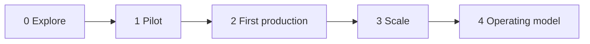
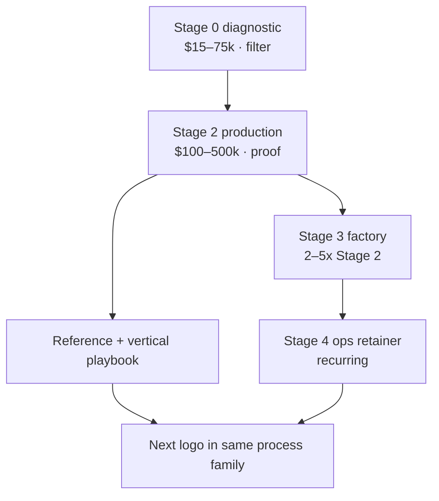

# How an AI project evolves — value add, capture, and how to be distinct

**Companion to** [ai-project-evolution-roadmap.md](ai-project-evolution-roadmap.md) and [corporate-ai-spend-opportunity.md](corporate-ai-spend-opportunity.md)  
**As of:** August 2026  
**Reader:** boutique / independent tech-transformation practice competing with MBB, Big 4, SIs, hyperscalers, and the client’s own CoE

This is the operating manual for the funnel. For each stage: what the client is living through, what you actually do, the **value you add** (client P&L), the **value you capture** (your revenue, margin, and right to the next stage), and how to be **distinct** from the firms that already occupy the room.

Two ledgers, always:

| Ledger | Question | If you only optimize this… |
| --- | --- | --- |
| **Client value** | Did a named process get faster, cheaper, safer, or able to do something new — on a metric a CFO will sign? | You become a charity with good slides. |
| **Firm capture** | Did that outcome convert into paid scope, a follow-on, a reference, and a reusable asset? | You become a body shop with no compounding. |

The firms that lose in 2026–27 optimize only one ledger. MBB captures fees without shipping. SIs capture hours without a metric. Boutiques that “just build” capture a project and get replaced by the vendor. The distinct position is: **same seniors who scoped it sit in the process, ship production, transfer the capability, and stay for the economics of the next ten workflows.**

---

## Snapshot: where money and distinction sit

| Stage | Client value created | Firm capture (directional, boutique) | Distinct vs competitors | Walk away if… |
| --- | --- | --- | --- | --- |
| **0 Explore** | Stops wasted vendor tours; names the one process that can hit P&L | $15k–$75k diagnostic; **option on Stage 2** | Paid, 2–4 weeks, kill criterion in writing. Not a free “AI strategy.” | They want a 40-use-case roadmap and no owner |
| **1 Pilot** | Proves the workflow on *their* data, with a production date | $50k–$150k — only as a **gate**, not a product | Pilot is a contract clause, not a deliverable. No “Phase 1 complete” without go-live criteria | They want a demo on a CSV and a six-month CoE |
| **2 First production** | First EBIT-visible win (cycle time, leakage, BPO $) | **$100k–$500k** core; 40–55% contribution if senior-delivered | Named process + baseline + weekly cost dashboard. Partner in the work | Procurement wants 12 workstreams and 20 juniors |
| **3 Scale** | Second workflow is 40–60% cheaper than the first | $250k–$1.5M program or retainer | Shared context/FinOps/eval — you sell the **factory**, not another demo | They want to copy-paste the agent into 30 teams with no data work |
| **4 Operating model** | AI becomes a managed cost of production, not a project | $8k–$40k/month + expansion | Own cost-per-outcome with the CFO. Capability transfer, not lock-in theater | They want you to run it forever with no internal owner |

**Capture math that matters:** Stage 0 is not the business. Stage 2 is the **proof**. Stages 3–4 are **80%+ of lifetime revenue** on a good account. Design Stage 0 so it can only convert if Stage 2 is possible.

A $1B-revenue client planning 1.7% of revenue on AI (BCG) has ~$17M in the pool. A boutique that owns the critical workflow and then the factory should target **$0.5–2M year-one**, not the CoE periphery.

---

## Stage 0 — Explore: turn FOMO into a killable plan

### What the client is living through

They already “have AI.” Copilot is rolled out. A CoE exists. Shadow AI is everywhere (MIT: workers at ~90% of firms use personal tools; ~40% of firms bought an official seat). Twelve vendors have demoed. The CEO now owns the decision (BCG: 72%) and half believe their job depends on 2026 ROI. The CIO is exhausted. The CFO has seen spend and no EBIT (McKinsey: 88% use AI, 39% report any EBIT).

Nobody needs another landscape. They need someone to **say no** to 37 of 40 ideas and attach a date and a metric to the rest.

### What actually happens (2–4 weeks)

Week 1 — **Recon, not workshops.** Sit with the process, not the steering committee. Map shadow AI vs official AI. Pull the last 90 days of the candidate process (tickets, close calendar, claims aging, AP holds). Identify the P&L owner by name.

Week 2 — **Economics, not architecture.** Baseline cost-to-serve (labor + BPO + error + delay). Sketch cost-of-agent (tokens, supervision, exception handling — McKinsey: refinement is ~60% of agent cost). Buy vs build vs embed (Menlo: 76% of use cases are now purchased).

Week 3–4 — **Decision pack.** Three workflows ranked by (economic headroom × data readiness × political owner). One recommended. A 90-day production plan. A **kill criterion** (“if we cannot access system X by week 3, we stop”). RACI. What you will not do.

### Value you add (client)

- Saves 6–12 months of vendor tourism. MIT: enterprises lead in *pilot volume* and lag in *scale-up*.
- Redirects budget from board-visible sales/marketing tools toward back-office P&L (MIT’s documented $2–10M BPO / document-review saves).
- Makes the CEO’s ownership usable: one number, one date, one owner.
- Surfaces the real constraint early (permissions, unstructured mess, no process owner) — 8 in 10 firms later cite data as the agent-scale wall.

### Value you capture (firm)

| Capture lever | How |
| --- | --- |
| **Fee** | Fixed $15k–$75k. Never free. Free diagnostics attract FOMO buyers who will not fund Stage 2. |
| **Margin** | High (70%+) if two seniors run it. This is a filter, not a staffing vehicle. |
| **Option value** | Contractual right of first refusal on Stage 2 if they proceed within 60 days. This is the real asset. |
| **Asset** | Anonymized process-economics library (close, claims, KYC, AP). Compounds proposal speed. |
| **Reference** | Only if they convert. Do not collect “we did a strategy” logos. |

**Do not** try to make Stage 0 a $400k “AI strategy.” That is MBB’s product, it is saturated, and it does not convert to EBIT. Your Stage 0 is a **paid qualification**.

### How competitors play this — and how you are distinct

| Competitor | Their move | Why it wins for them | Your distinction |
| --- | --- | --- | --- |
| **MBB (McKinsey QuantumBlack, BCG X, Bain Vector)** | 8–12 week strategy, 40-use-case heatmap, board narrative. Day rates $3k–$5k+. $500k–$2M. | CEO wants cover. Brand is part of the mandate at Fortune 500. | You will not out-narrative them. **Refuse the heatmap.** Walk in with *one* process already baselined from their own ops data. Time-to-production in the SOW, not in an appendix. |
| **Big 4** | Readiness, risk, CoE operating model, EU AI Act slideware bundled with audit trust. | Regulated buyer wants one throat to choke. | Acknowledge risk; **embed classification and controls in the production plan**, not as a parallel 16-week workstream. |
| **SI (Accenture, IBM, Capgemini)** | Multi-workstream “AI factory” proposal. Juniors appear after the partner leaves. | Scale story. | Named seniors in the SOW, **hours-in-the-process** (floor-walking, ticket queues), no offshore pyramid on Stage 0. |
| **Hyperscaler + partner** | Reference architecture and credits. | Cheap to start. | Architecture is not the constraint. You sell **which workflow and what kill switch**, then use their stack. |
| **Internal CoE** | Use-case intake form, 40-item backlog. | Political safety. | MIT: internal builds fail ~2× vs external. You are the team that **picks and kills**, not the team that facilitates the backlog. |
| **Other boutiques** | Free workshop → hope. | Gets in the door. | Paid diagnostic + written kill criterion. You are expensive to *start* and cheap to *finish* relative to SIs. |

**Distinct sentence you should be able to say in the first meeting:**

> “We will not write you an AI strategy. In four weeks you will have three ranked processes, one recommended, a 90-day production plan, and a date on which we stop if the data or the owner is not real. If that is not useful, we are the wrong firm.”

### Traps

- Running a “use case workshop” that produces a backlog. That is the CoE’s job and it is how you become indistinguishable.
- Accepting a CIO as the only sponsor. BCG: the CEO owns this; Stage 2 dies without a P&L owner.
- Delivering 80 slides. Deliver a 12-page decision memo and a one-page economic model.

**Exit to Stage 1/2:** written owner, system access path, baseline metric, production date. If any of the four is missing, do not start a pilot.

---

## Stage 1 — Pilot: a gate with a production date, not a product

### What the client is living through

Someone (often a vendor) already ran a POC. It worked on 50 golden documents. The steering committee loved the demo. IT has not connected it to the system of record. Legal has not approved production data. The team that would use it was not in the room. This is the MIT “learning gap”: tools that do not remember, do not fit, and get quietly rejected after the applause.

Gartner’s 2027 cancellation forecast is mostly **pilots that never should have been called projects**.

### What actually happens (4–8 weeks — only if Stage 2 is already scoped)

- Rebuild the happy path on **production-like data** (not a CSV export from 2024).
- Instrument exceptions: what share needs a human, what the human does, how long that takes. McKinsey: ~60% of agent cost is refinement/rework. If you do not measure this in the pilot, the production bill will shock the CFO.
- Define the **promotion criteria** in writing: accuracy/eval threshold, latency, cost per completed case, human-in-the-loop policy, rollback.
- Security and access: least-privilege to the two systems that matter. Not an enterprise IAM program.
- A go / no-go meeting with the P&L owner, not the CoE.

If the client insists on a pilot *without* a production SOW in draft, price it as a **disposable experiment** and do not staff your best people as if it will convert. Conversion rate from orphan pilots is poor; it trains the client that AI is theater.

### Value you add (client)

- Prevents the nine-month enterprise stall (MIT). Mid-market winners go pilot → production in ~90 days; you are selling that clock.
- Discovers the *real* exception taxonomy (the thing that makes agents 30× more expensive on the same task).
- Gives Legal/Risk a bounded object to approve, instead of “AI” in the abstract.
- Creates the first eval set the client will actually reuse. That eval set is the beginning of Stage 3.

### Value you capture (firm)

| Capture lever | How |
| --- | --- |
| **Fee** | $50k–$150k fixed. Include a **credit of 30–50%** against Stage 2 if they proceed in 30 days. That credit is how you capture conversion without looking cheap. |
| **Margin** | Protect it. Two seniors + one engineer. No pyramid. |
| **IP** | Eval harness, exception taxonomy, prompt/tool patterns for *this process family* (e.g. invoice exceptions, claims FNOL). Reusable across accounts in the same vertical. |
| **Risk** | Cap liability to the fee. You are not yet in production. |
| **Qualification** | If promotion criteria fail, you **recommend kill**. Charging for an honest no is brand. It is also how you avoid becoming part of the 40% Gartner will watch get canceled. |

### How to be distinct

| Competitor | Typical pilot | Your distinction |
| --- | --- | --- |
| **Vendor / ISV** | Sandbox demo, success = “users liked it.” | Success = **promotion criteria**. You are willing to fail the vendor’s tool. |
| **SI** | 12-week “POC factory” with 8 workstreams. | One process, production-like data, 4–8 weeks, named promotion bar. |
| **MBB** | Prototype in a lab, then handoff. McKinsey-style: diagnostic → strategy → prototype → *someone else* implements. | **No handoff.** The people who ran the pilot are the people who will go live. Write that into both SOWs. |
| **CoE** | Innovation-theater sprint. | You measure cost-per-case in the pilot. CoEs measure “experiments completed.” |

**Distinct sentence:**

> “A pilot without a production date is a demo. We will only run this if we have already agreed what ‘good’ means, who owns the live process, and what happens in week 9 if we pass the bar.”

### Traps

- Calling a Copilot rollout a pilot. That is seat deployment. It will not show up in EBIT.
- Training a custom model. Menlo: enterprises buy. Custom models at this stage are how you become a science project.
- “Agent washing” — wrapping a chatbot. Gartner: only ~130 of thousands of agent vendors are real. Do not join them.

**Exit to Stage 2:** promotion criteria met or explicitly waived with residual risk owned by the client; production access; support model; cost forecast using *pilot* token reality, not vendor list prices.

---

## Stage 2 — First production workflow: this is the firm-making stage

This is where 95% of GenAI programs fail to create P&L (MIT) and where **your brand is actually built**. Everything before this is permission. Everything after this is compounding.

### What the client is living through

The process still runs on email, Excel, and a 2014 SOP. People who do the work are skeptical (BCG: confidence falls as you leave the C-suite). IT is afraid of another integration. The CEO wants a 2026 win. The incumbent SI has a 14-month plan. The vendor says “just turn on our agent.”

Your job is to **redesign the work**, not to decorate it. McKinsey high performers are ~3× as likely to have fundamentally redesigned workflows. Gartner’s own agent advice: rethink workflows from the ground up; use agents for decisions, automation for routine, assistants for retrieval.

### What actually happens (10–16 weeks mid-market; 6–12 months only if the estate is truly heavy)

**Weeks 1–3 — Process, not prompts.** Shadow the live queue. Rewrite the SOP as: what the agent may do, what it must cite, when it must stop, who handles which exception. This *is* the transformation. If you skip it you have a chatbot.

**Weeks 2–6 — Context and integration.** Connect the two or three systems of record. Retrieval over the *current* policy corpus. Permissions that match the human role. Lineage so an auditor can see why a case moved. This is the data wall McKinsey flags — do it for **this workflow**, not the enterprise.

**Weeks 4–10 — Build in the open.** Agent + tools + eval harness + human desktop for exceptions. Daily or thrice-weekly release to a shadow mode (agent proposes, human still acts), then supervised, then bounded autonomy.

**Weeks 8–14 — Change that is not a poster.** The people in the queue pair with you. Trailblazer CEOs put ~60% of AI budget into upskilling; you do it *on the process*, not in a portal. Shadow-AI power users become champions (Gartner: 88% of employees with enterprise AI also use personal tools).

**Weeks 12–16 — Harden.** Rollback, logging, cost dashboard (cost per completed case, not tokens), on-call, kill switch. CFO pack: baseline vs actual, residual human cost, sensitivity if volume doubles.

Pick processes where the metric already exists: days-to-close, claims cycle time, AP hold aging, KYC aging, first-contact resolution, leakage. Back office beats board-visible marketing. MIT’s million-dollar saves were BPO, document review, risk checks, agency spend — not “smarter campaigns.”

### Value you add (client)

- First **detectable** EBIT or cost-to-serve movement. That is the thing 61% of companies cannot show.
- A working pattern: SOP + context + eval + stop-rules. Worth more than the agent.
- Political cover for the CEO who bet their 2026 narrative on agents.
- A reference the next buyer in the industry will actually believe (production, not a lab).

### Value you capture (firm)

| Capture lever | How |
| --- | --- |
| **Fee** | Boutique $100k–$500k fixed-scope with milestone gates. SI-equivalent work at $500k–$2M if you are pulled into a large estate — only if you keep senior density. |
| **Margin** | Target **40–55%**. Below 35% you have been pulled into SI economics (leverage, change orders, waiting on access). Price access delay as a client-owned pause, not free bench. |
| **Milestone capture** | 30% on kickoff (access + baseline locked), 40% on shadow-mode live, 30% on production + CFO pack. Ties cash to outcomes without fake “gain share” you cannot audit. |
| **Gain share (optional, later)** | Only after one quarter of production telemetry. Example: 15–20% of verified run-rate savings for 12 months, capped. Do not lead with this; buyers in 2026 have been burned. Earn the right. |
| **Expansion seed** | Stage 3 is pre-written: “the second workflow reuses X% of the context/eval/FinOps layer.” Quote it at Stage 2 signature. |
| **Reference + residual IP** | Case study with a number. Internal playbook for that process family. This is how a 12-person firm competes with Accenture’s 77,000. |

**Unit economics (illustrative, mid-market finance-ops production):**

- Price $280k over 14 weeks
- Delivery: 1 partner (0.3 FTE), 1 principal in the process (1.0), 2 engineers (1.5), 1 change lead (0.5)
- Loaded cost ~$150k → ~46% contribution
- If it converts to a $40k/month Stage 3/4 retainer for 12 months, **lifetime revenue ~$760k** from a $280k door. That is the capture model. Stage 2 without Stage 3 is a job, not a firm.

### How to be distinct (this is the stage that makes or breaks it)

| Competitor | How they staff Stage 2 | What the client experiences | Your distinction — make it contractual |
| --- | --- | --- | --- |
| **MBB** | Strategy team exits; QuantumBlack / BCG X / a partner SI “implements.” Knowledge stays in the firm. | Beautiful prototype, messy handoff, 3–6 months before production starts. | **Same named people from Stage 0/1 through go-live.** No strategy-to-delivery seam. |
| **Big 4 / SI** | Partner sells; pyramid delivers; vendor alliance shapes the stack (Microsoft, Salesforce, AWS). 6–18 months. $500k–several million. Incentives favor duration. | Lots of governance, slow integration, junior workshops. | **Time-box 90 days to first supervised production** on one process. Publish a weekly cost-and-quality dashboard to the CFO from week 3. Vendor-agnostic routing (McKinsey’s own lesson: match model to task). |
| **Hyperscaler** | Reference architecture, professional services as SKU. | Works in their cloud; does not redesign the SOP. | You use their platform; you **own the process outcome**. You are not their reseller. Disclose if you are. |
| **Vertical SaaS / agent vendor** | Land the seat, expand. PLG. 47% of AI deals convert vs 25% SaaS (Menlo) — they are good at this. | Fast start, shallow fit, lock-in. | You may **select and implement them**. You remain the party measured on the process metric. If the vendor fails the eval, you replace the vendor, not the program. |
| **Internal build** | CoE + contractors. MIT: fails ~2× as often. | Slow, politically safe, rarely production. | You transfer the eval harness and SOP to them as an exit asset. Distinct from SIs who retain the knowledge. |
| **Other boutiques** | Build a clever agent, skip change and FinOps. | Cool demo, angry ops team, surprise bill. | **Three artifacts at go-live:** (1) redesigned SOP, (2) cost-per-completed-case dashboard, (3) trained queue team. No artifact, no “done.” |

**Five distinction rules to print on the proposal:**

1. **One process, one owner, one metric.** Never 12 workstreams.
2. **Seniors in the queue.** Partner/principal hours in the live process, named, with a minimum %.
3. **Eval before autonomy.** Shadow → supervised → bounded. Autonomy is earned.
4. **Cost per outcome from week 3.** Tokens are the bill, not the value (McKinsey, Jul 2026).
5. **Transfer, don’t nest.** Client owns the SOP, evals, prompts, and vendor contracts at exit. You stay because they *want* the factory, not because they *can’t* leave.

**Distinct sentence:**

> “We will not stand up an AI program. We will put this process into production in 90 days, on your systems, with a kill switch, a cost-per-case number, and your people running it. If we miss the metric, we do not get to sell you the next ten use cases.”

### Traps

- Accepting “phase 2: scale to the enterprise” before phase 1 has a metric.
- Building a platform. Stage 2 is a **thin slice** through the future platform, not the platform.
- Fighting the SI for the whole transformation budget. Attach *beside* them on one process; steal the narrative with a number.
- Underpricing change. Skipping it is how production rolls back in week six.

---

## Stage 3 — Scale: sell the factory, not the next demo

### What the client is living through

One workflow works. Every VP now wants “the same thing.” Costs are climbing (93% of firms already over AI budget). Each team is rebuilding RAG. Two vendors are in production. Security just realized agents can *do* things. This is where high performers pull away: shared context, routing, eval, FinOps — or a pile of brittle bots headed for the 2027 cull.

McKinsey: fewer than 10% of agent experiments have scaled to tangible value. The wall is data and reuse, not ideas.

### What actually happens (4–9 months)

- **Context layer for a domain** (finance ops, claims, customer ops): ontology-lite, retrieval, permissions, telemetry. Reusable across the next 3–8 workflows.
- **Intelligence routing:** frontier model only when it changes the outcome; small/cheap models for the rest. Same task can vary 30× in cost.
- **Eval as a product:** golden sets, regression on every change, hallucination/policy-break rates.
- **FinOps:** pooled consumption, unit cost per outcome, anomaly alerts. CFO monthly.
- **Second and third workflows** that reuse 40–60% of Stage 2 assets. If reuse is below 25%, you did not build a factory — you built two projects.
- **Governance that ships:** mandate, budget, stop-rule per agent. Not a 200-page policy.

### Value you add (client)

- Marginal cost of the next workflow collapses. That *is* the ROI of scale.
- Prevents the 40% cancellation: unclear value and runaway cost are two of Gartner’s three causes.
- Turns AI from a project portfolio into a **production system**.
- Starts the “context moat” McKinsey describes — proprietary process telemetry competitors cannot buy.

### Value you capture (firm)

| Capture lever | How |
| --- | --- |
| **Fee** | $250k–$1.5M program, or $25k–$80k/month retainer + per-workflow SOWs. Retainer is better capture: it aligns you to the factory. |
| **Margin** | 45–60% on the factory layer (reusable). 35–45% on each new workflow (still custom). Mix toward the factory. |
| **Productization** | Your vertical playbook (e.g. “month-end close in SAP-centric mid-market”) becomes a product with a name, a price, and a 90-day clock. This is how you stop competing on hours. |
| **Switching costs (ethical)** | They stay because the evals, FinOps, and context are understood by your team — and because you documented them well enough that they *could* leave. Paradoxically, easy-exit raises win rate and tenure. |
| **Multi-threading** | CHRO (enablement), CISO (agent oversight), CFO (unit economics) now have reasons to keep you, not only the original VP. |

**Capture target:** Stage 3 should be **2–5× Stage 2 revenue** on the same account within 12 months. If it is not, you under-sold the factory or you picked a client with no second process.

### How to be distinct

| Competitor | Scale move | Your distinction |
| --- | --- | --- |
| **SI** | “AI factory” as a 50-person managed service. You never leave. | Factory **assets** (context, eval, routing) owned by the client; you operate and improve them under a retainer with an exit clause. |
| **Platform vendors** (Databricks, ServiceNow, Salesforce, hyperscalers) | Land-and-expand the platform. Indirect services overtake direct consulting around 2028 (Gartner). | You **ride the platform** and remain the process/economics owner. You do not compete with ServiceNow; you make their agent work on *this* claim type. |
| **MBB** | Operating-model PowerPoint, then another diagnostic. | Operating model **instantiated** as routing policies, cost dashboards, and stop-rules in production. |
| **CoE** | Prioritization committee. | You bring a **reuse metric** to the committee: % of components reused. That is a grown-up KPI. CoEs track use cases launched. |

**Distinct sentence:**

> “The second workflow should cost about half the first. If it doesn’t, we built a demo twice. We are here to sell you the factory that makes that math true.”

### Traps

- Cloning the agent into new teams without cloning the SOP and permissions. That is how you manufacture Gartner’s 40%.
- Building an internal LLM platform. Buy routing; build glue.
- Expanding into a domain where you have no process credibility (e.g. from AP into clinical AI). Stay in the process family until you have two references.

---

## Stage 4 — Agentic operating model: become the CFO’s AI operator

### What the client is living through

AI is heading toward a material share of IT spend (McKinsey: on a path to ~25% over several years). Agents consume intelligence on behalf of users. 10% of users drive ~65% of tokens (McKinsey’s own usage). The CEO still owns the narrative (BCG: by 2028, industry success = who got AI right). Nobody owns **machine work** as a discipline the way they own lean, cyber, or cloud FinOps.

This stage barely exists in the market. That is why it is the 2028–30 demand. If you only sell projects, a vendor or SI will eat this.

### What actually happens (ongoing)

- Allocate intelligence like capital: workload placement (API vs private vs vendor agent), model routing, autonomy budgets.
- Measure **cost per completed business outcome** and tail costs, not averages.
- People system: Gartner predicts 50% of firms without a people-centric AI strategy lose top AI talent by 2027. Enablement is now retention and ROI, not training hours.
- Sourcing review: what comes back in-house because context is the crown jewel; what stays out.
- Board/CFO cadence: AI as an economic asset class.

### Value you add (client)

- Turns a cost spiral into a managed production input.
- Survives the trough: you are the reason they are not in the canceled 40%.
- Competitive: same commercial agents, better context and governance, better unit economics.

### Value you capture (firm)

| Capture lever | How |
| --- | --- |
| **Fee** | $8k–$40k/month boutique for AI ops + quarterly operating-model reviews. Large estate: much more, but then you are competing with Accenture managed services — only play there with a sharp vertical. |
| **Margin** | 50%+ if productized (dashboards, playbooks, routing policies). Falls if it becomes staff aug. |
| **Durability** | This is **recurring**. Protect it with a 90-day exit, a client-side owner, and a documented runbook. Recurring + easy exit is a premium brand in 2026. |
| **New logo engine** | Stage 4 clients are the only references that survive 2027. Use them. |

### How to be distinct

| Competitor | Their Stage 4 | Your distinction |
| --- | --- | --- |
| **MSP / SI managed services** | Ticket-based keep-the-lights-on, junior NOC. | You sit with the **CFO on unit economics** and with ops on autonomy policy. Not a helpdesk for prompts. |
| **FinOps startups / cloud economics tools** | Token dashboards. | Tokens plus **process outcomes**. Tools without the redesigned SOP are another dashboard nobody trusts. |
| **MBB** | Another CEO article. | You already run their machine-work P&L. Strategy is a quarterly byproduct of operations. |
| **Internal CAIO** | Coordination without teeth. | You are the **implementation arm** of that office, with a sunset clause as they hire. Help them hire. Distinct firms create successors. |

**Distinct sentence:**

> “We run machine work like a factory: every agent has a mandate, a budget, a stop-rule, and a cost per completed case. You can fire us in 90 days because you will own the runbook. Clients don’t.”

---

## How capture compounds (the firm-level model)

**Healthy boutique mix (year 2+):**

- 10–15% revenue Stage 0–1 (pipeline)
- 35–45% Stage 2 (proof, references)
- 25–35% Stage 3 (where profit lives)
- 15–25% Stage 4 (durability)

If Stage 0–1 exceeds 30% of revenue, you are a workshop mill. If Stage 2 exceeds 70%, you are a project shop and will feel the 2027 trough. If Stage 4 has no exit clause, you are a body shop.

**Pricing posture vs competitors (use this in proposals):**

| | MBB | Big 4 / SI | Typical boutique | Distinct boutique (this playbook) |
| --- | --- | --- | --- | --- |
| What they sell | Narrative + optionality | Hours + risk cover + platform | A build | A **production metric** then a **factory** |
| Who delivers | Seniors sell, mix delivers | Pyramid | Seniors | **Named seniors in the process**, written |
| Clock | 8–12 weeks to a deck; months to handoff | 6–18 months | 8–12 weeks to a system | **90 days to supervised production**, then factory |
| Economic unit | Day rate | Day rate × headcount | Project | **Cost per outcome** shared with the CFO |
| Knowledge | Stays with firm | Stays with firm | Often stays with heroes | **Transferred** + retainer because the factory still needs operators |
| Win condition | Board comfort | Not getting fired | Clever demo | **Second workflow is half the cost of the first** |

Day rate is a trap. A $3,500/day MBB partner on the account five days can be cheaper — and less useful — than a $1,800/day principal in the queue for 60 days. Propose **partner time-in-writing** and **days-to-metric**, never rate wars.

---

## A worked example (so the stages are concrete)

**Client:** $800M industrial, SAP finance, 18-day month-end close, heavy Excel accruals. CEO owns AI. A Big 4 already delivered a 2025 “AI roadmap.” Copilot is live; EBIT impact is zero.

| Stage | You do | Client value | You capture | Distinct move vs the Big 4 already in the account |
| --- | --- | --- | --- | --- |
| **0** (3 weeks, $45k) | Baseline close: 18 days, $1.1M/year in overtime + delayed reporting. Shadow AI: controllers live in ChatGPT on personal seats. Recommend **accruals + flux commentary** only. Kill if SAP read access slips 10 days. | Stops a $2M “finance AI program.” Names one process. | $45k + ROFR on production | You will not refresh their roadmap. You will sit in last month’s close. |
| **1** (5 weeks, $90k, 50% credit to Stage 2) | Shadow-mode agent on prior-period accruals. Exception taxonomy: 22% need a human. Cost/case in pilot: $0.84 vs $12 labor. Promotion bar: 95% citation, <8% silent miss. | Proof on *their* SAP data. | $90k; $45k credits forward | Big 4 proposed a 6-month “Finance CoE.” You have a bar and a week-9 date. |
| **2** (14 weeks, $320k) | Redesign close SOP. Agent proposes accruals; controller accepts. Flux drafts with sources. Go-live close #1: 18 → 12 days. Dashboard to CFO. | ~$400k/year run-rate (overtime + faster lock) plus controller time. | $320k, ~45% contribution; case study | Same three people from Stage 0. Weekly CFO pack. SI is still standing up the CoE. |
| **3** (6 months, $40k/mo + $180k for AP holds) | Context layer over SAP + close binders. Second workflow: AP dispute. Reuse 50%+. FinOps: model routing cuts unit cost 35%. | Close → 10 days; AP leakage visible. Factory exists. | ~$420k; retainer starts | You sell reuse %. Big 4 sells more workstreams. |
| **4** (ongoing, $15k/mo) | Cost per close, autonomy policy, quarterly placement review (what stays in SAP’s own AI vs your glue). Train successor. | AI is a line in the close, not a project. | $180k/year, 90-day exit | You help them hire the internal owner. Distinct from managed-services lock-in. |

Lifetime year-1 revenue ~$1.0M. Client value in year-2 run-rate comfortably clears fees. The Big 4 may still “own AI” on paper. You own the number the CEO can say in the board meeting. **That is the distinction that survives 2027.**

---

## Competitive positioning you can actually use

### Who you are not

- Not MBB: you do not sell courage to the board as the product.
- Not Big 4: you do not sell audit comfort as the product.
- Not Accenture: you cannot (and should not) field 200 people across 14 countries.
- Not the hyperscaler: you do not sell tokens.
- Not the CoE: you do not facilitate a backlog.

### Who you are (one paragraph for the website and the SOW)

> We take one economically critical workflow from its current SOP to **supervised production in 90 days**, on the systems you already have, with a cost-per-completed-case dashboard and a kill switch. The people who scope it build it and sit in the process. We then install the **factory** (context, eval, routing, FinOps) so the second workflow costs about half the first. You own the assets. We stay on a retainer you can exit in 90 days. We do not do AI strategy decks, custom foundation models, or Copilot rollouts.

### Who you refuse (this is also distinction)

- RFPs for “enterprise AI strategy” with no process owner.
- Pilot-only budgets with no production path.
- Custom LLM training as the first move.
- Programs whose success metric is seats, prompts, or use cases launched.
- Accounts where a partner will not let you talk to the people who do the work.

Refusal is brand. The 2027 cull will punish firms that said yes to all of the above.

### Proof points to collect on purpose (so distinction is evidence, not vibe)

1. Days from kickoff to supervised production  
2. Baseline vs actual on the process metric  
3. Cost per completed case, week 3 vs week 16  
4. % of Stage 3 components reused on workflow #2  
5. Named client employees who can run it without you  
6. One kill you recommended that the client accepted  

Six numbers beat a capabilities brochure.

---

## Sequence to run this year

1. **Productize Stage 0** as a named, fixed-price diagnostic with a kill criterion. Stop giving it away.  
2. **Pick one process family** (close, claims, KYC, AP, ticket-to-resolution) and run two Stage 2s. Depth beats breadth against SIs.  
3. **Write Stage 3 into every Stage 2 SOW** as an optional clause with the “half the cost” reuse target.  
4. **Instrument distinction:** seniors-in-the-process %, days-to-metric, cost-per-outcome, exit assets. Put them on page 1 of every proposal next to the competitor’s workstream map.  
5. **Do not hire a pyramid** to chase SI-shaped deals. That is how boutiques become bad SIs and lose the only advantage they have.

The project evolves from **story → demo → production metric → factory → operating system**. Your firm should evolve the same way. Competitors are stacked at story and demo. The scarce, expensive, defensible position is **production metric plus factory**, with knowledge transferred and economics shared with the CFO.
